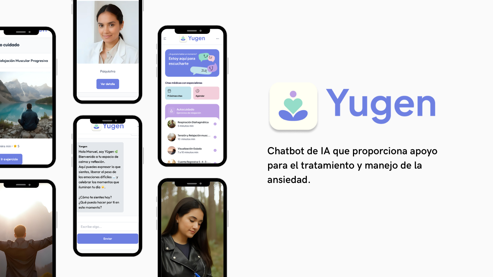

# 🌿 Yugen - Chatbot de Ansiedad con IA

**Yugen** es un chatbot de inteligencia artificial especializado en ansiedad, creado para acompañar y aconsejar a las personas en momentos difíciles.  
No reemplaza a un terapeuta, pero entrega técnicas de **Terapia Cognitivo Conductual (TCC)** basadas en materiales creados por profesionales de la salud mental, además de conectar con redes de apoyo en caso de emergencia.  

El alma de Yugen está en su identidad: no busca entregar un manual traducido, sino generar **conexión real** con los usuarios de Latinoamérica. Refleja nuestra **idiosincrasia**, presente en el lenguaje, los colores, las imágenes y la forma en que pensamos y sentimos.  
De esta manera, cada persona se siente **acompañada, entendida y representada**.  

---

## 🚀 Contexto del Proyecto
Este proyecto fue desarrollado en la **Hackathon Desafío Latam + Oracle 2025**, con el objetivo de proponer soluciones innovadoras en el ámbito de la salud y la tecnología.  

- 🧠 **Problema**: La ansiedad es el trastorno de salud mental más común en el mundo. En Latinoamérica, 1 de cada 4 personas la padece, pero menos del 30% recibe atención adecuada.  
- 💡 **Solución**: Un chatbot accesible, empático y culturalmente adaptado que brinda acompañamiento inmediato y confiable.  

---

## 📸 Vista previa    
  

👉 Puedes probar el **frontend de la aplicación aquí**:  
🔗 [https://dashboard2-sooty.vercel.app/](https://dashboard2-sooty.vercel.app/)  

---

## 🛠️ Tecnologías utilizadas
- **Frontend**: 
- React + Vercel 
- Next.js 15.x
- React 19
- TypeScript
- Tailwind CSS V4
- **Backend / Integraciones**: 
- Oracle + APIs de soporte  
- **IA**: Técnicas basadas en TCC y contenidos de profesionales  

---

## 📌 Nota importante
Yugen **no reemplaza a un profesional de la salud mental**, pero ofrece acompañamiento seguro y técnicas validadas por expertos para el manejo de la ansiedad.  

